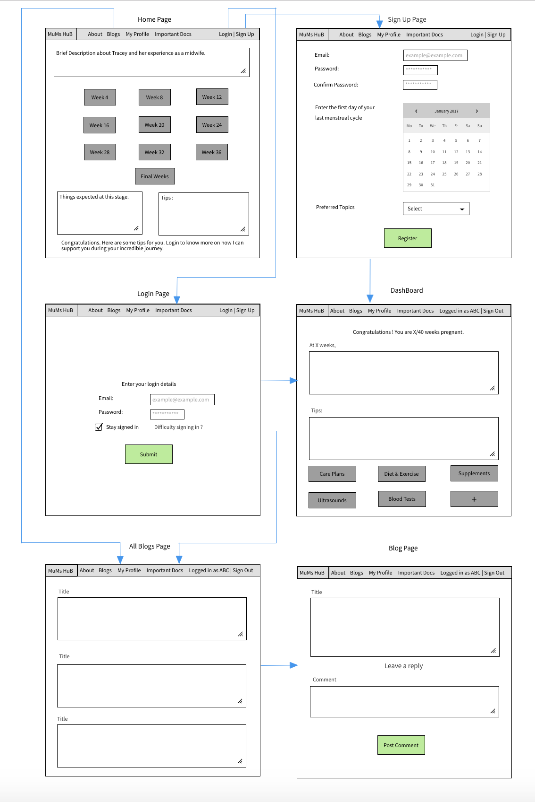
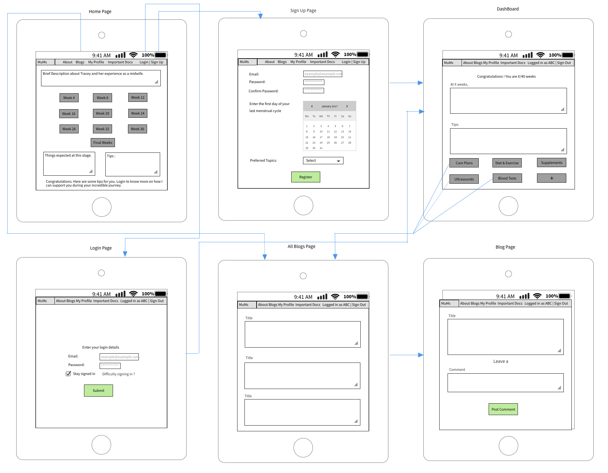

# Mums-hub
Created By Sherine Mathew, Mark Ying and Jeffrey Dorling

## Description 
### Purpose
Mums-hub is a website that is designed as an informative blog to help pregnant woman navigate through 
childbirthing process.  

### Functionality/Features
#### A Blog
- Where users will be able to read and comment on posts
- Administrators will be able to Create, Edit and Delete posts

#### A Dashboard for aspiring mothers which will track;-
- Due Dates 
- Weekly Tips
- Generic information about the stage of pregnancy the mother is currently going through

#### User Authentication
- Which gives us the ability to differentiate between Administrators and Users
- Abilities to Sign Up, Sign In and Sign Out

### Target Audience
The key Target Audience woman in any stage of pregnancy looking for information on the process of childbirth. 
It will centre around informing these woman of what they are going through and tips on how to make this as 
easy as possible.  

### Technologies Used
This has been developed utilising the MERN technologies. The stack includes;-
- MongoDB
- Express
- React
- NodeJS
## Dataflow Diagram

## Application Architecture Diagram 

## User Stories
- As a user, I would like to be able to read a blog post related on child birth topics so I can be more informed on this topic.
- As a user, I would like to comment on a blog post as I may have questions or take part in community discussion.
- As a user, I would like to be able to sign up to register an account.  
- As a user, I would like to be able to sign in to my account to access information tailored to my needs. 
- As a user, I would like to be able to sign out of my account when it is not in use.
- As a user, I would like to read my dashboard which displays information in a nice, easy to read layout
- As a user, I would like to see tips on pregnancy on my dashboard, relative to my needs
- As an administrative user, I would like to be able to create a blog post to inform my audience on a range of child birth related topics. 
- As an administrative user, I would like to be able to edit a blog post as a means of fact checking and ensuring the content is of a high quality and always reliable. 
- As an administrative user, I would like to be able to delete a blog post when a post is deemed irrelevent or unnecessary.
- As an administrative user, I would like to be able to comment on a blog post, responding to other users comments and questions, furthering discussion. 
- As an administrative user, I would like to be able to see a list of my blog posts as an easy to access position which helps manage the content I am putting to my audience. 

## Wireframes

### Desktop

### Tablet/iPad

### Mobile

## Planning Methodology with Screenshots 

