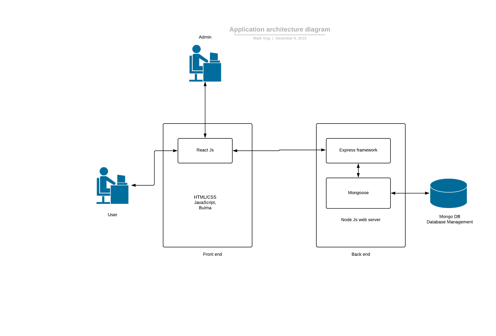
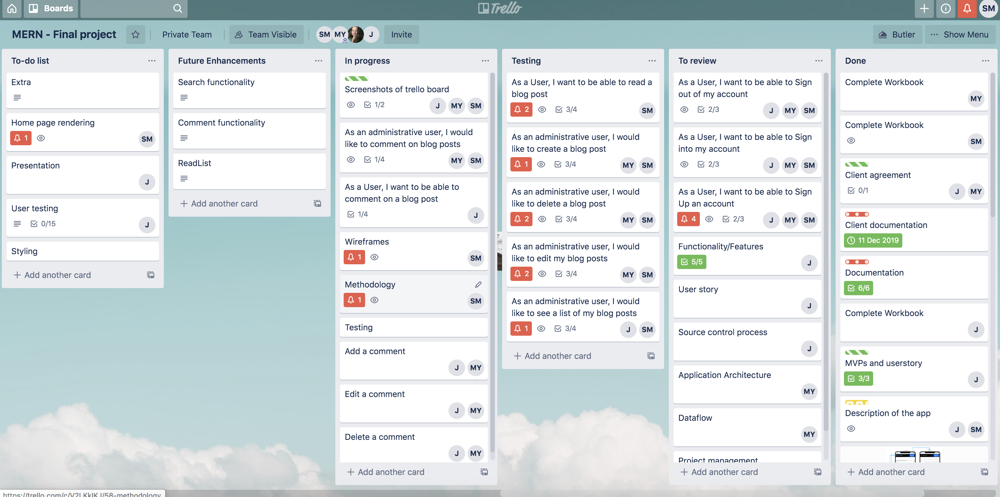
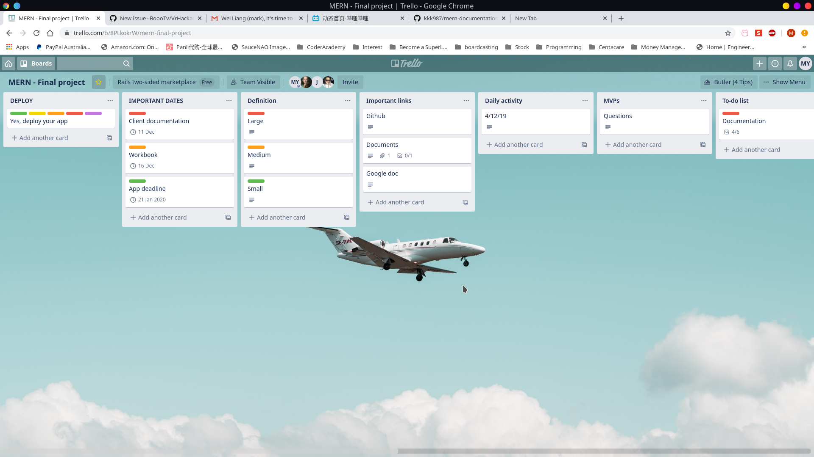
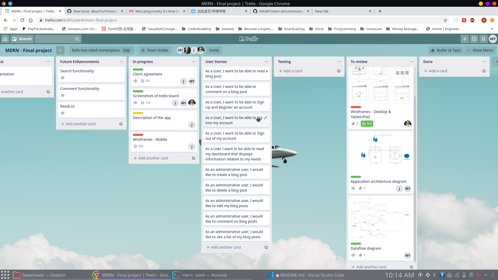
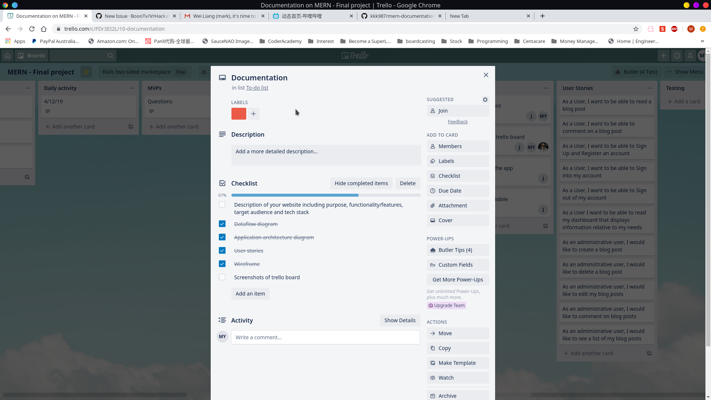

# Mums-hub
Created By Sherine Mary Mathew, Mark Ying and Jeffrey Dorling.

- Deployed website - 
    Backend - https://sheltered-garden-84149.herokuapp.com/
    Front End - http://floating-badlands-48821.herokuapp.com/

- Github repository - [Client repository]( https://github.com/kkk987/Mums-hub )
                    - [Server repository]( https://github.com/kkk987/mums-hub-server)
                    - [Document repository] https://github.com/kkk987/mums-hub-doc

## Description 
### Purpose
Mums-hub is a website that is designed as an informative blog to help pregnant woman navigate through 
pregnancy. 

Pregnancy is one of the most exciting as well as daunting times in a woman's life. Optimizing health and wellbeing during pregnancy is essential for the woman; her family’s and her infant’s future and ongoing health. Unfortunately for a number of women, pregnancy can be a stressful period and lead to significant physical and psychological illness. This website is developed to provide information to women with the emotional and physical support they need to endure this process. 

Blogs are created by Tracey Dorling who has a massive 20+ years of experience working as a midwife. A typical pregnancy lasts 40 weeks from the first day of the last menstrual period (LMP) to the birth of the baby. It is divided into three stages, called trimesters: first trimester, second trimester, and third trimester. The fetus undergoes many changes throughout maturation. Tracey has explained what pregnancy is all about in a week to week development stage. She has explained clearly what to expect in a particular week, what is normal during that week and what are the options available to better manage pregnancy. Visitors to this website can read blogs and also allows them to register as a user. Once registered, personalized posts are provided. Users can search through a variety of topics that they are interested in. They can also comment on the post and share their experience or ask a question related to the post.

### Functionality/Features
#### A Blog
- Where registered users will be able to read and comment on posts.
- Administrators will be able to Create, Edit and Delete posts.

#### User Authentication
- Which gives us the ability to differentiate between Administrators and Users.
- Abilities to Sign Up, Sign In and Sign Out.

#### MVP functionality
- Administrators can create, update, delete and comment a post. 
- Registered users are capable of reading blogs, comments and create their own comments.

Without some more information, the Dashboard was not implemented in the MVP. This will be added once weekly tips and predetermined advice is set.
User Authentication currently differentiates between Administrators and Users. The ability to sign in, sign up and sign out.

#### Future functionality
The ability for administrators to comment directly to other comments. This is to communicate directly to users asking questions.
Once content and other information is attained, the Dashboard would be found specific for the user who is registered 
As it currently stands, the user is capable of every user story we attempted to implement with the exception of managing the users dashboard and access information tailored to user's needs. The dashboard is still being implemented and the information is yet to be added to the project.

### Target Audience
Mums-Hub targets women audiences in any stage of pregnancy.
It will centre around informing women of what they are going through and tips on how to make this as 
easy as possible.

### Technologies Used
This has been developed utilizing the MERN technologies. The stack includes -

- MongoDB
- Express
- React
- NodeJS
- SCSS (Including Bulma for some styling)
- Heroku for deployment.
- Git/Github for source control.
- Cypress for testing.

## Dataflow Diagram

The above image shows the dataflow diagram before the development. There are some differences between the plan and the actual implementation which include:

- Admin authentication   
    There are some changes to user authentication especially for an admin. The original plan was to separately authenticate the admin user and a normal registered user. However it is found that it would over complicate other problem such as verifying users before they try to make a post which may require multiple accesses to database and consequently slows the efficiency. To simplify the authentication process, we modified the user schema in database with an extra property called 'role'. For admin accounts, this property is set to 'admin' when they are created. At this stage, users cannot apply for admin role through normal registration process.

- Comments storage   
    Another change to comments part is how we store them in the database. The original plan was to create an independent database to keep comments. Since mongo is a non-relational database, it turns out that it is not efficient enough to access all comments that belong to a specific post. Instead, we store those comments with the post that they are related to. By doing this, we can easily access the post and all comments attached to it.

- Dashboard   
    The actual dashboard implemented is different to the original design. The original design will show weekly tips to users when they login. The actual implementation will show user with all posts sorted in latest modified date to oldest modified date order. There are 2 reasons we decided to do this way. First reason is that we have a tight time frame which limited our productivity. The second reason is that the weekly tips is a future enhancement and we decided to complete MVPs first.

- Notification feature   
    Notification feature is also a future enhancement. And for the same reason as the changes to dashboard, we decided to complete MVPs first.

## Application Architecture Diagram 

The above image shows the designed application architecture.
The actual implementation follows the design exactly that admin users and normal users can only interact with the react app. And the react app will send requests to back-end to access required data in mongoose.

### Project management

The tool we used to manage the jobs is trello. We will be delegating job cards and following along with what cards are complete and incomplete. This was considered and agreed to during the first team meeting. It was also approved to all members with a better visualization of the job status(like to-do, in-progress etc.), difficulty, estimated time and job priority.

## User Stories

- As a user, I can register a new account.  
- As a user, I can sign in to my account. 
- As a user, I can accept/decline the disclaimer.
- As a logged-in user, I can sign out of my account.
- As a user, I can read a blog related to pregnancy.
- As a logged-in user, I can comment on a blog.
- As a logged-in user, I can manage my dashboard
- As a logged-in user, I can access information tailored to my needs.
- As an administrative user, I can create a blog. 
- As an administrative user, I can edit a blog. 
- As an administrative user, I can delete a blog.

## Wireframes

Please find below some of the screenshots of the website that will be delivered to the client.

About page - This pages gives an overview/description of the Mums-Hub website. 

The disclaimer - This page describes the disclaimer that the website is not to be followed as a medical advice and it is just informative.

Blog Posts page - This page displays all the posts that are written by Tracy Dorling.

RegisterUser - This page displays a form where the user can register to the website with a username, password, email address and the due date. 

Login Page - This page asks for the login information.

Add a post page - This page is used to add a post. This functionality is available only to the admin. The admin can add a post mentioning the title and the content.

Displays the post added with Edit and Delete buttons - Once the post is added, the Edit and Delete buttons are available for the admin to make appropriate changes to the post.

Displays the form to update a particular post - This page is for updating a post. This is available only to the admin.

## Planning Methodology with Screenshots

We implemented the Kanban framework to implement agile software development. 

We start the day with daily standup to track our progress and the tasks for the day. If anyone is blocked at any point, we would work together to resolve the problem. We had standup meeting in 2-3 hour gaps to make sure we are on track.

Our team used a trello board to create and track our tasks. We created cards that align with the user stories and the project's rubric, in order to make sure that we covered every angle that we needed for the project.

We had a column in our trello board that referenced the requirements, sizing, priorities, and deadlines, as well as what we hoped to achieve in our MVP and possible future enhancements. Our another column was a reference to our user stories so that we could quickly see what card was referencing what user story.

Our main columns for the Trello board were as follows:
 - To Do list - a long list of the tasks we wished to get done. This list had cards we had prioritized to work on next when we were finished what we were currently working on. This allowed some easier sorting and prioritizing of our tasks.
 - In Progress - cards we were currently working on
 - Testing column and Review column- cards which were waiting to be checked and merged into master in a pull request. These cards may need to be moved back into in progress if necessary after the review.
 - Complete - our finished tasks.

Each day we worked on a daily sprint with a goal of what we wanted to complete. We talked together on what each wanted to do in order to meet our daily goal, and tasks were then allocated to each team member. Some tasks we worked together in pair programming, other times we worked individually on a task.

### Trello
The tool we used to manage the jobs is trello. We will be delegating job cards and following along with what cards are complete and incomplete. This was considered and agreed to during the first team meeting. It was also approved by all members with a better visualization of the job status(like to-do, in-progress etc.), difficulty, estimated time and job priority.   

### Source control process

When we move to development stage, we will use github as our main source control platform. And we are following the feature branch workflow where we will derive feature branches from master branch. After the code is complete in each feature branch, the assigned team member is then required to raise pull requests. At least one other team member also reviews the code, approves it and make appropriate merges to the master branch.

When changes are made, the assigned team member makes appropriate changes on trello cards to update the progress.