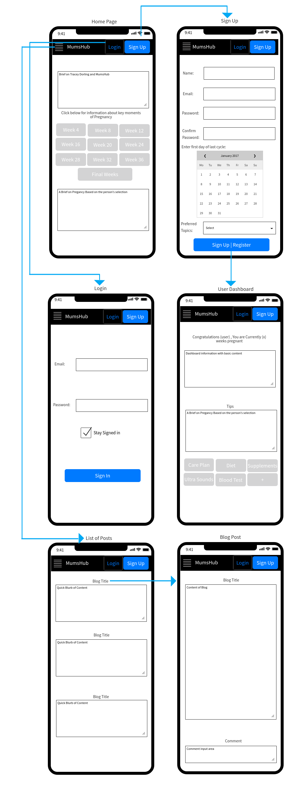

# Mums-hub
Created By Sherine Mathew, Mark Ying and Jeffrey Dorling

## Description 
### Purpose
Mums-hub is a website that is designed as an informative blog to help pregnant woman navigate through 
pregnancy. 

Pregnancy is one of the most exciting as well as daunting times in a woman's life. Optimising health and wellbeing during pregnancy is essential for the woman; her family’s and her infant’s future and ongoing health. Unfortunately for a number of women, pregnancy can be a stressful period and lead to significant physical and psychological illness. This website is developed to provide information to women with the emotional and physical support they need to endure this process. 

Blogs are created by Tracey Dorling who has a massive 20+ years of experience working as a midwife. A typical pregnancy lasts 40 weeks from the first day of the last menstrual period (LMP) to the birth of the baby. It is divided into three stages, called trimesters: first trimester, second trimester, and third trimester. The fetus undergoes many changes throughout maturation. Tracey has explained what preganancy is all about in a week to week development stage. She has explained clearly what to expect in a particular week, what is normal during that week and what are the options available to better manage pregnancy. Visitors to this website can read blogs and also allows them to register as a user. Once registered, personalised posts are provided. Users can search through a variety of topics that they are interested in. They can also comment on the post and share their experience or ask a question related to the post.

### Functionality/Features
#### A Blog
- Where registered users will be able to read and comment on posts.
- Administrators will be able to Create, Edit and Delete posts.

#### A Dashboard for aspiring mothers which will track;-
- Due Dates 
- Weekly Tips
- Generic information about the stage of pregnancy the woman is currently going through.

#### User Authentication
- Which gives us the ability to differentiate between Administrators and Users.
- Abilities to Sign Up, Sign In and Sign Out.

### Target Audience
Mums-Hub targets women audiences in any stage of pregnancy.
It will centre around informing women of what they are going through and tips on how to make this as 
easy as possible.

### Technologies Used
This has been developed utilising the MERN technologies. The stack includes;-
- MongoDB
- Express
- React
- NodeJS

## Dataflow Diagram

## Application Architecture Diagram 

## User Stories
- As a user, I would like to be able to read a blog post related on child birth topics so I can be more informed on this topic.
- As a user, I would like to comment on a blog post as I may have questions or take part in community discussion.
- As a user, I would like to be able to sign up to register an account.  
- As a user, I would like to be able to sign in to my account to access information tailored to my needs. 
- As a user, I would like to be able to sign out of my account when it is not in use.
- As a user, I would like to read my dashboard which displays information in a nice, easy to read layout
- As a user, I would like to see tips on pregnancy on my dashboard, relative to my needs
- As an administrative user, I would like to be able to create a blog post to inform my audience on a range of child birth related topics. 
- As an administrative user, I would like to be able to edit a blog post as a means of fact checking and ensuring the content is of a high quality and always reliable. 
- As an administrative user, I would like to be able to delete a blog post when a post is deemed irrelevent or unnecessary.
- As an administrative user, I would like to be able to comment on a blog post, responding to other users comments and questions, furthering discussion. 
- As an administrative user, I would like to be able to see a list of my blog posts as an easy to access position which helps manage the content I am putting to my audience. 

## Wireframes

### Desktop

### Tablet/iPad

### Mobile

## Planning Methodology with Screenshots
The planning methodology we have implemented is using Trello. We will be delegating job cards and following along with what cards are complete and incomplete. This was considered and agreed to, due to the ability of having clear jobs to complete in an easy process. It was also approved by all members due to the action of being able to see exactly the jobs are taking the largest times and being able to solve these larger problems together while quickly finishing the smaller jobs separately.   

## Source Control
We have planned to use Git source control to organise the development of our MERN application. This is due to the synergy with our planning methodology, trello. We are capable of creating feature branches that coincide with job cards on trello making it easier to organise what we have done and are yet to do. 